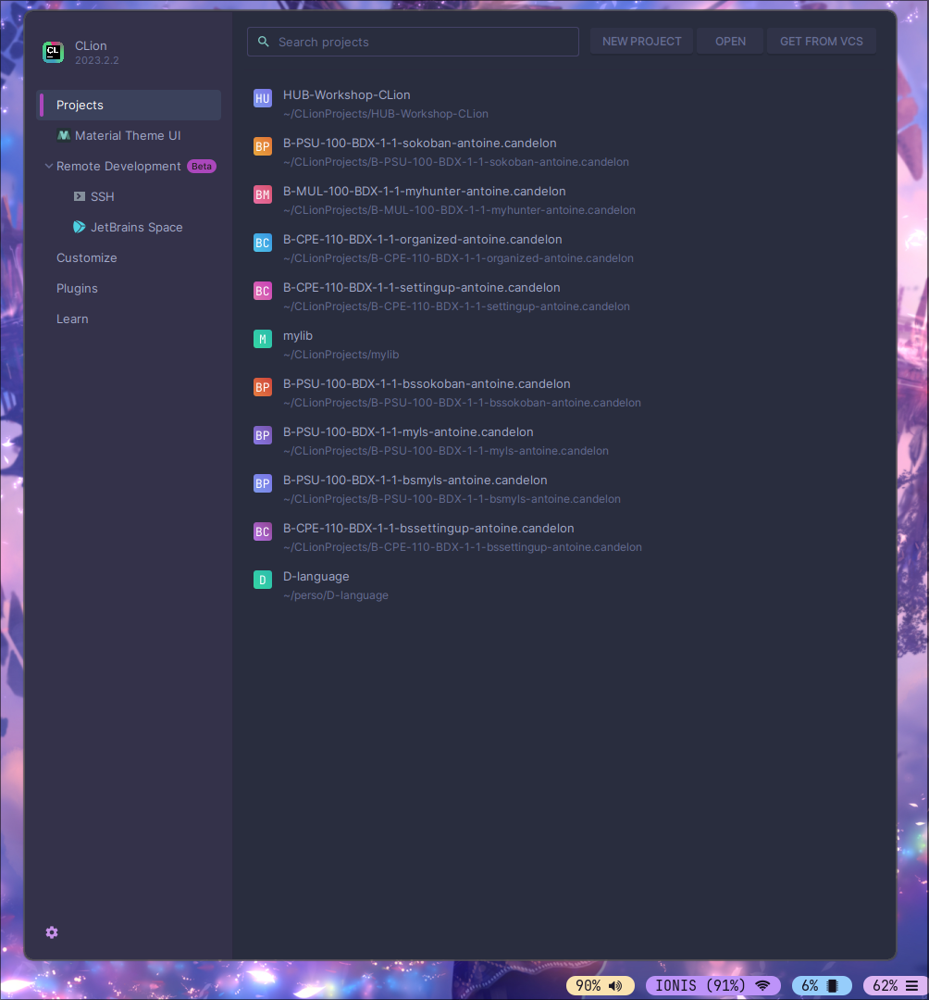
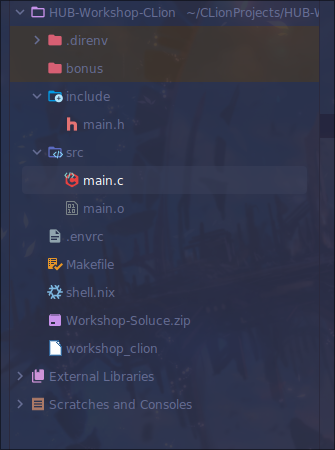

CLion: what is it and how to use it.

## Why use it?

CLion is a powerful IDE, unlike text editor it analyze your code to integrate seamlessly in your existing workflow and provide graphical interfaces for your CLI tools (Make, valgrind, etc).
It make easy to code, debug, and analyze your code for small project to big, multiple weeks projects.
It is intuitive, you don't need to configure a lot of things to get it up running, and once in it you can manage your project without ever leaving CLion.

## Know issues

* The cursor disappearing randomly on Linux
* High RAM usage (If you have more than 8GO of RAM it won't be an issue)
* Can take several seconds to load

## Requesting a student license

During this workshop we will use the free trial of CLion (of 30 days) but we will also quickly see at the end how to request a free student license to have CLion (or any Jetbrains tool) for free during your cursus at Epitech.

#### Installing CLion

*For those of you who haven't installed CLion, you can install it [here](https://www.jetbrains.com/clion/download/#section=linux)**

## How to open an existing project

During this workshop we will use this project as a template to test CLion utilities.
First clone this repository on your laptop using your terminal (I recommend cloning your project in C in the CLionProjects repository at your home directory). Next launch CLion you should see the projects window :

Here click on 'Open' and select the folder you just cloned (and not it's content !).

## Here we are, finally, in CLion

Now let's configure our project in CLion to enable all of its capabilities.
The use of a terminal during this workshop is prohibited, all actions need to be done inside of CLion (and no the integrated terminal doesn't count !)

What's need to be done:
* Import the Makefile project
* Configure the Makefile pipeline
* Fix the program
* Build and run
> And you can relax, you now know how to use CLion, but there is more !

To improve your skills you can also:
* Look at how the debugger works
* Refactor quickly your code using the `Extract methodes` utility
* Use the GUI to make a make, manage what changes are inside a commit
* Take a first look at the git window
* Setup the Epitech Headers as a .c (and .h) file template
* Setup the `Settings sync` system, to never lose your precious IDE configuration

Remember, everyone has a slight different IDE configuration, customize your config to make it suit your needs.

##### The plugins I recommend:

- Atom Material Icons
- Discord Integration
- Material Theme UI

#### End result:

This should be what your project look like at the end of this workshop: 
*The color highlighting is what we are looking after*

> `.direnv` and `.envrc` should be ignored
